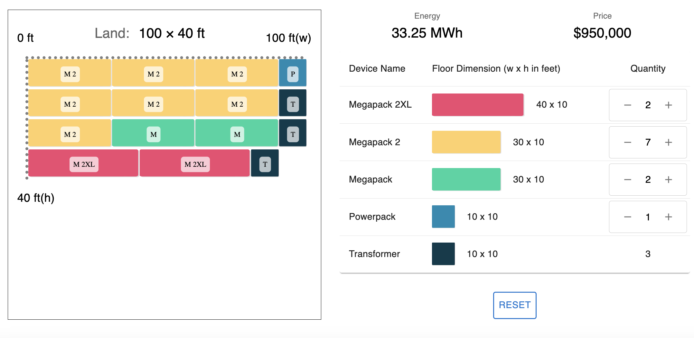

# Battery Site Mockup

The Battery Site Mockup is an intuitive application designed for creating visual mockups of site layouts for industrial energy battery installations.



## Tech Stack
- Frontend: TypeScript, Material UI, React.js
- Backend: Express.js 
- Testing: Jest (frontend), Mocha (backend)
  - Refer to [Battery Mockup API](https://github.com/taekim-dev/battery-mockup-api) for backend details.

## Installation & Running

1. Clone the repository:
    ```
    git clone https://github.com/taekim-dev/battery-site-mockup.git
    ```
2. Navigate into the directory:
    ```
    cd battery-site-mockup
    ```
3. Install dependencies:
    ```
    npm install
    ```
4. Start the local server:
    ```
    npm run dev
    ```
Access the server at `http://localhost:8000`.

## Features

1. **Dynamic Calculations**: Total Energy and Price for all devices are calculated dynamically and displayed at the top of the device selection.
2. **Interactive Layout**: The corresponding land block gets added to the layout grid as a user selects devices.
3. **Efficient Organization**: The battery layout is arranged to minimize land usage.
4. **Adaptive Height**: The layout's current height adjusts as more devices are added.
5. **Land Requirement Display**: The total land requirement is displayed at the top of the layout.

## Assumptions
- A Transformer is added for every 4 battery quantities.
- There is no space between devices in the layout.
- The total quantity of battery devices could be large.
- The width of the layout does not exceed 100ft.


## Future Enhancements
- **Budget Page**: Input budget to receive optimal device selection and layout.
- **Save Function**: Save current data for future reference.
- **Share Function**: Export and share layout and energy and price data.  
